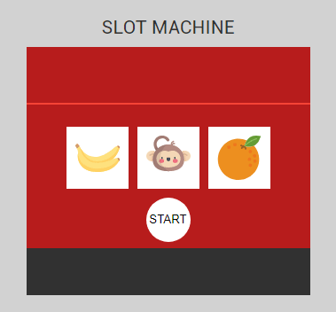

# Slot machine

A minimalist slot machine.  

The wheels of slot machine spins every 50ms, there are a lot of approaches to make it happen but considering the shortest path to cover the requirements, I've decided to make an Array and loop it changing an integer value (between 0 and 3).  

The wheels are independent and they show an image based on the provided integer.  

To avoid image loading issues I've tried to build something to check image status but it didn't work smoothly... I also tried some libraries like `react-lazyload` but it also didn't worked as expected. To solve this, quickly, I've decided to work with CSS classes and just switch them based on current face (integer between 0 and 3)... It isn't the best solution since its consuming a good slice of CPU and I do intend to provide updates to this project in order to find a better solution through React Hooks.  

Since this project uses React hooks and not everything is fully integrated with them, this is an experimental project.

More tests will be added as libraries evolve to a more stable scenario.
This project was bootstrapped with [Create React App](https://github.com/facebook/create-react-app). ♥

## Online demo
http://slotmachine.numen.com.br

## Usage

To interact with the slot machine you can clone this repository, move the the folder and run
`npm install`, wait until it completes and then run `npm start`. You should be able to see the slot machine at http://localhost:3000.

## Available Scripts

In the project directory, you can run:

### `npm start`

Runs the app in the development mode. 
Open [http://localhost:3000](http://localhost:3000) to view it in the browser.

### `npm test`

Launches the test runner in the interactive watch mode. 

### `npm test -- --coverage`

Launches the test runner in the interactive watch mode and also shows coverage. 

### `npm run build`

Builds the app for production to the `build` folder.
It correctly bundles React in production mode and optimizes the build for the best performance.
